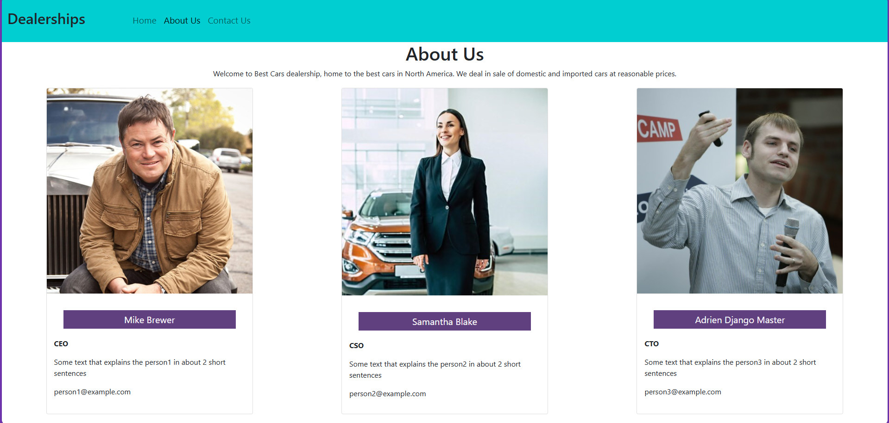
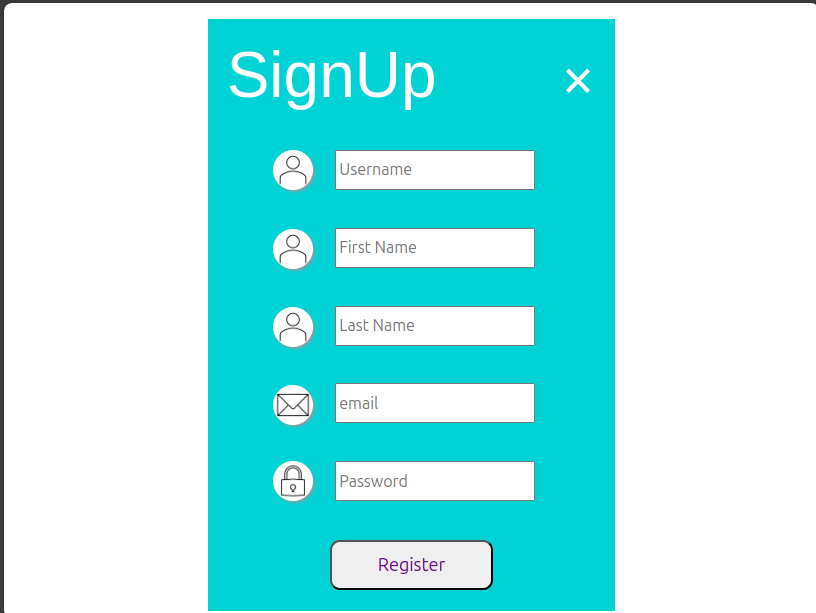
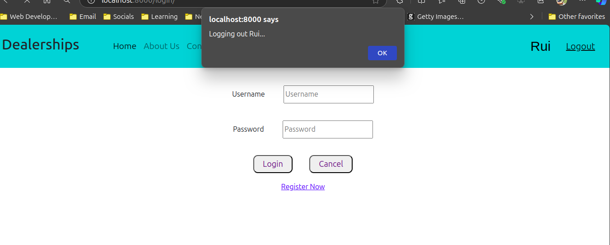
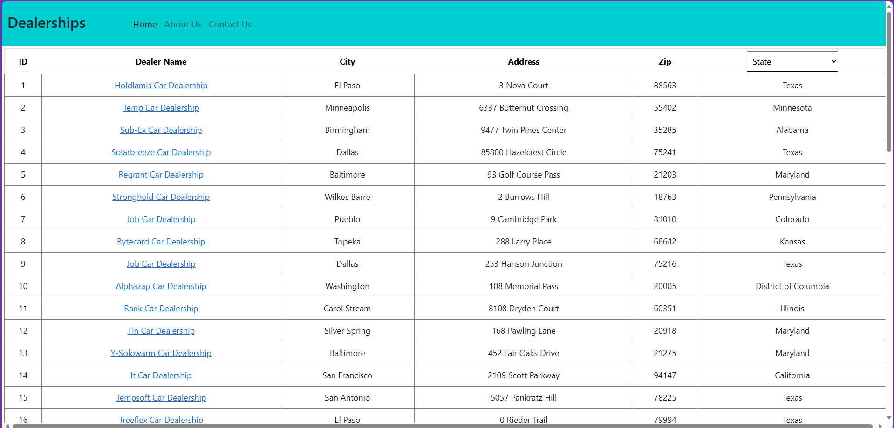

# Preview
This is the final capstone project for my full-stack developer course. The following stacks where used:
- Django
- React
- MongoDB
- Docker
- Kubernetes

# Architecture
- The Django application provides the following microservices for the end user:  
  `get_cars/` - To get the list of cars from  
  `get_dealers/` - To get the list of dealers  
  `get_dealers/:state` - To get dealers by state  
  `dealer/:id` - To get dealer by id  
  `review/dealer/:id` - To get reviews specific to a dealer  
  `add_review/` - To post review about a dealer  

- The Django application uses SQLite database to store the Car Make and the Car Model data.  

- The "Dealerships and Reviews Service" is an Express Mongo service running in a Docker container. It provides the following services::  
`/fetchDealers` - To fetch the dealers  
`/fetchDealer/:id` - To fetch the dealer by id  
`fetchReviews` - To fetch all the reviews  
`fetchReview/dealer/:id` - To fetch reviews for a dealer by id  
`/insertReview` - To insert a review  
"Dealerships Website" interacts with the "Dealership and Reviews Service" through the "Django Proxy Service" contained within the Django Application.  

- The "Sentiment Analyzer Service" is deployed on IBM Cloud Code Engine, it provides the following service:  
`/analyze/:text` - To analyze the sentiment of the text passed. It returns positive, negative or neutral.  
The "Dealerships Website" consumes the "Sentiment Analyzer Service" to analyze the sentiments of the reviews through the Django Proxy contained within the Django application.  

